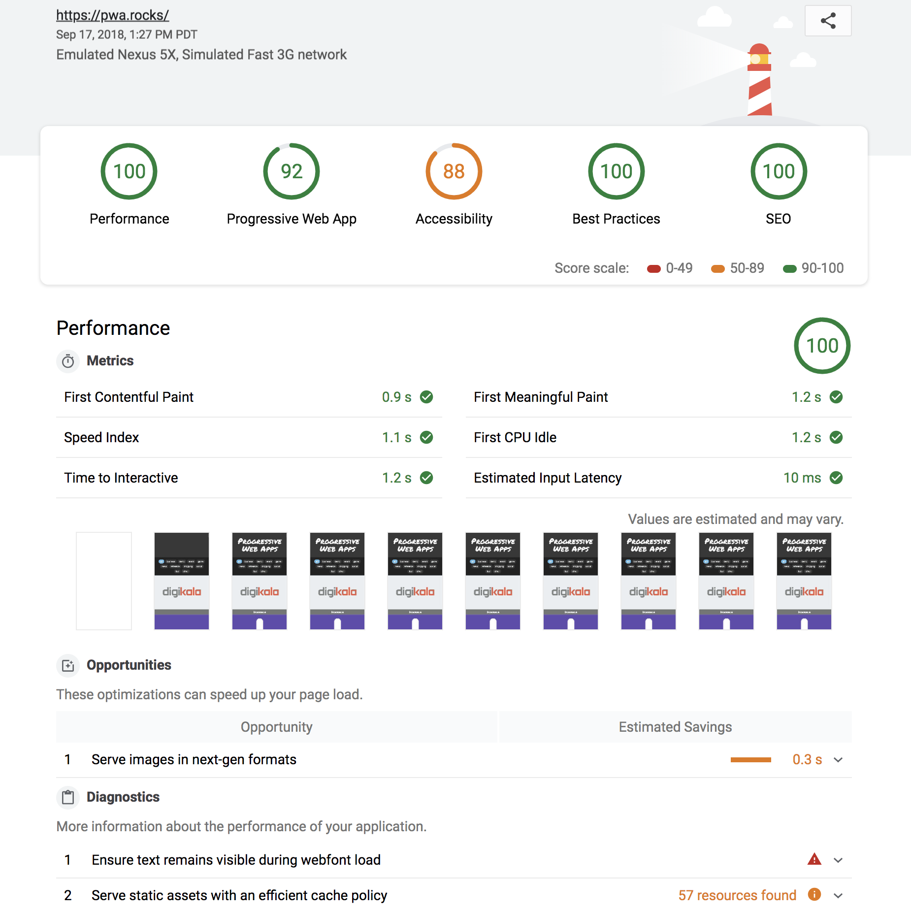

# Webpack Lighthouse Plugin

This plugin allows you to run  from a Webpack build.

在 Webpack 打包结束后自动运行 [Lighthouse](https://github.com/googlechrome/lighthouse) 以评估网站的性能和用户体验。

## 旧版本文档

旧版本文档演示了如何运行，见：https://github.com/addyosmani/webpack-lighthouse-plugin。

## 新增功能

修复了部分问题。此外，可通过配置项传入完整的 Lighthouse 以及 Chrome 启动参数。

相关文档：

* [Lighthouse@Github](https://github.com/GoogleChrome/lighthouse)
* [Lighthouse@API](https://github.com/GoogleChrome/lighthouse/blob/master/docs/configuration.md)
* [AllChromeFlags](https://peter.sh/experiments/chromium-command-line-switches)

## 评估模式

* [机器类型](https://github.com/GoogleChrome/lighthouse/blob/master/docs/throttling.md#benchmarking-cpu-power)：高端PC（CPU 性能约等于 16" Macbook Pro）、中低端PC（CPU 性能约等于 Intel NUC i3）
* 加密协议：HTTP、HTTPS
* 缓存内容：无缓存刷新（硬刷新）、完整缓存后刷新（软刷新）
