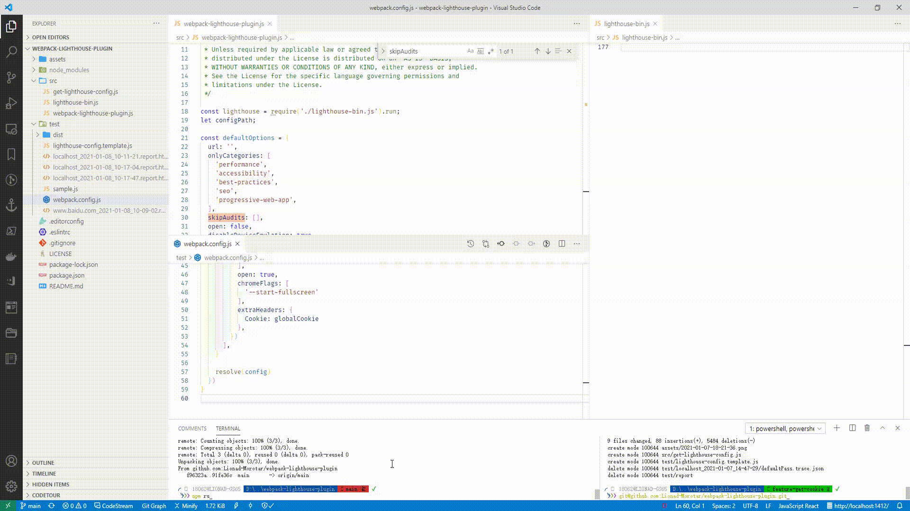

# Webpack Lighthouse Plugin

This plugin allows you to run Lighthouse from a Webpack build.

在 Webpack 打包结束后自动运行 [Lighthouse](https://github.com/googlechrome/lighthouse) 以评估网站的性能和用户体验。



## 代码示例 Example

配置 webpack.config.js。

Import module then plug it in webpack.

```js
const WebpackLighthousePlugin = require('webpack-lighthouse-plugin')

module.exports = {
  // ...
  plugins: [
    new WebpackLighthousePlugin({
      url: 'www.baidu.com'
    })
  ],
  // ...
}
```

可传入 Chrome 启动参数。

Enable chrome start flags.

```js
new WebpackLighthousePlugin({
  url: 'www.baidu.com',
  chromeFlags: [
    // 全屏启动 Chrome
    // open chrome in fullscreen mode
    '--start-fullscreen'
  ],
})
```

更多 API：

```js
new WebpackLighthousePlugin({
  // URL can be an array
  url: ['www.baidu.com'],
  // open report html when task done
  open: true,
  // customize request headers
  extraHeaders: {
    Cookie: 'xxx'
  },
  // only performance, accessibility, seo categories
  onlyCategories: [
    'performance',
    'accessibility',
    'seo',
  ],
  // network and cpu throttling
  throttling: {
    rttMs: 100,
    cpuSlowdownMultiplier: 4
  },
  // ... and more
  // pls check out this page: https://github.com/GoogleChrome/lighthouse/blob/master/docs/configuration.md
})
```

完整的配置示例。

Full API.

```js
{
  url: ['https://www.baidu.com'],
  onlyCategories:
    ['performance',
      'accessibility',
      'best-practices',
      'seo',
      'progressive-web-app'],
  skipAudits: ['uses-http2'],
  open: true,
  disableDeviceEmulation: true,
  disableCPUThrottling: true,
  disableNetworkThrottling: true,
  logLevel: 'info',
  output: 'html',
  maxWaitForFcp: 15000,
  maxWaitForLoad: 35000,
  maxWaitForLoad: 35000,
  emulatedFormFactor: 'desktop',
  throttling: { rttMs: 40, throughputKbps: 10240, cpuSlowdownMultiplier: 1 },
  skipAudits: ['uses-http2'],
  audits:
    [{ path: 'metrics/first-contentful-paint', options: [Object] },
    { path: 'metrics/first-meaningful-paint', options: [Object] },
    { path: 'metrics/speed-index', options: [Object] },
    { path: 'metrics/interactive', options: [Object] },
    { path: 'metrics/first-cpu-idle', options: [Object] }],
  chromeFlags: ['--start-fullscreen'],
  extraHeaders:
  {
    Cookie: ''
  }
}
```

## 相关文档

* [Lighthouse Homepage](https://github.com/GoogleChrome/lighthouse)
* [Lighthouse Configuration](https://github.com/GoogleChrome/lighthouse/blob/master/docs/configuration.md)
* [Chrome Flags](https://peter.sh/experiments/chromium-command-line-switches)
